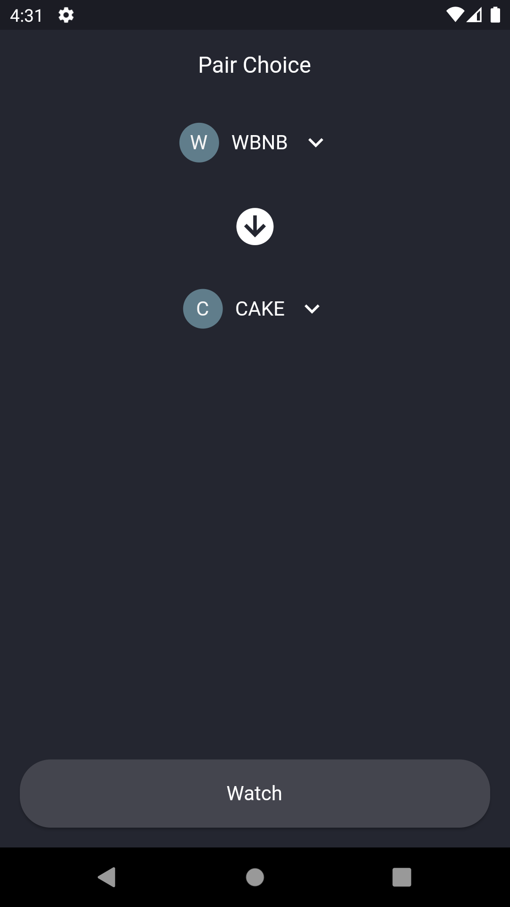
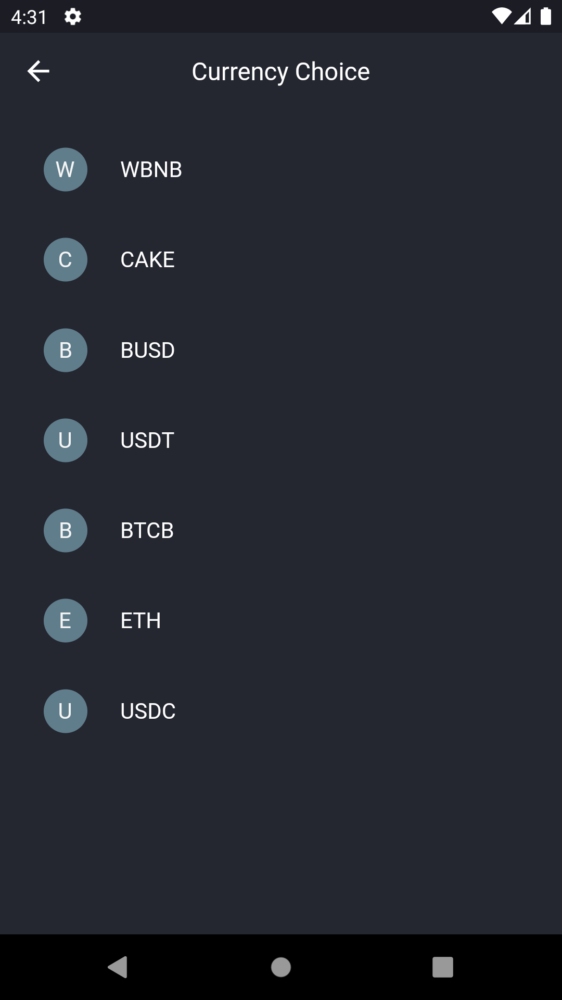
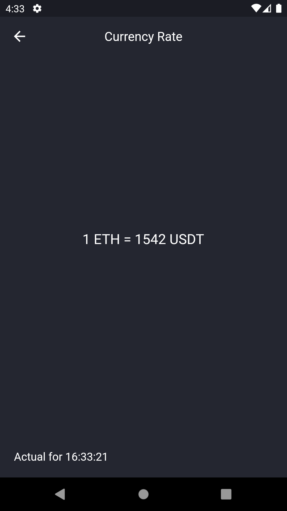

# PancakeSwapFlutter

Simple Flutter project for check exchange rate of the selected currency pair

Created with:

- [web3dart](https://pub.dev/packages/web3dart)
- [PancakeSwap](https://pancakeswap.finance/swap)

## Demo:

1. Main page - choosing a currency pair

<p align="center">

</p>

2. Page for choosing currency

<p align="center">

</p>

3. Page for viewing the exchange rate with an update of information every 25 seconds

<p align="center">

</p>

## Getting price method

```dart
Future<void> getPrice(String token1Address, String token2Address) async {
    String abi =
        await rootBundle.loadString('assets/abi/pancake_swap_abi.json');
    DeployedContract contract = await _getContract(abi);        // Getting contract

    final getThePriceContract = contract.function('getAmountsOut');
    final gettingThePrice = await ethereumClient.call(          // Call function from .abi
      contract: contract,
      function: getThePriceContract,
      params: <dynamic>[
        BigInt.from(1),                                         // Amount first token
        [
          EthereumAddress.fromHex(token1Address),               // First token address
          EthereumAddress.fromHex(token2Address)                // Second token address
        ],
      ],
    );
    dateOfReceipt = DateFormat.Hms().format(DateTime.now());    // Date of function call  
    result = gettingThePrice.first[1].toString();

    fetchingTimer = Timer.periodic(const Duration(seconds: 25), // Setup timer for get updated data
        (_) => getPrice(token1Address, token2Address));
    notifyListeners();
  }
```
